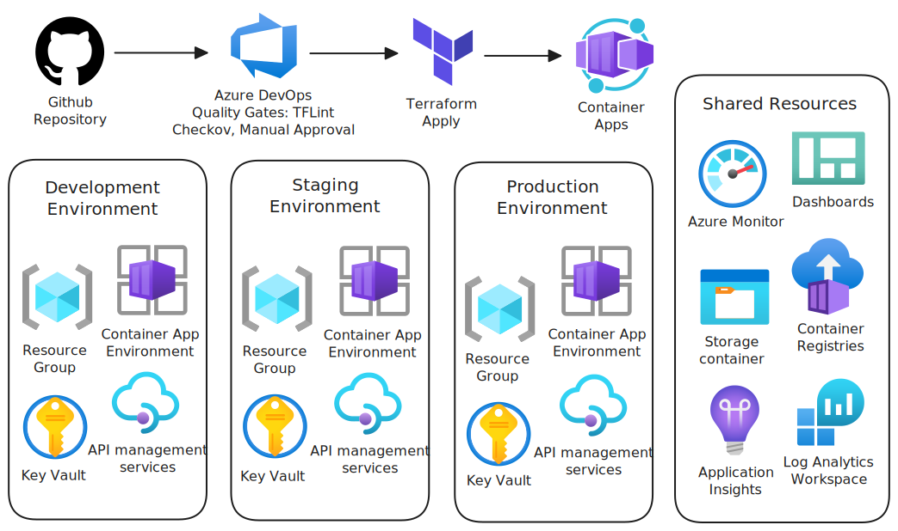

# Azure Container Apps with Terraform + Azure DevOps

[](https://github.com/Simodalstix/Azure-devops-container-apps/actions)
[](https://opensource.org/licenses/MIT)
[](https://github.com/Simodalstix/Azure-devops-container-apps/releases)
[](https://www.terraform.io/)
[](https://docs.microsoft.com/en-us/cli/azure/)

Production-ready Azure Container Apps platform with Terraform IaC and enterprise DevOps pipelines. Demonstrates multi-environment deployment, monitoring, security, and compliance best practices.

**Quick Start:** [GETTING_STARTED.md](GETTING_STARTED.md) - Deploy in 10 minutes

## Architecture



_Architecture diagram created using Azure official icons and Excalidraw_

## Infrastructure Provisioned

**Shared Resources** (cost-optimized):

- Azure Container Registry
- Log Analytics Workspace
- Application Insights

**Per Environment** (dev/staging/prod):

- Container Apps Environment
- Key Vault
- Resource Groups
- Monitoring & Alerts

**Sample Application**:

- Node.js API with health checks
- Auto-scaling container app
- Application Insights integration

## Why This Matters

- **Scalability**: Auto-scaling serverless containers
- **Resilience**: Multi-environment deployment with proper separation
- **Compliance**: Enterprise-grade security, monitoring, and audit trails
- **Developer Experience**: Infrastructure as Code with automated deployments
- **Cost Efficiency**: Shared resources and serverless scaling

## Quickstart

```bash
# 1. Setup credentials
az login
export ARM_SUBSCRIPTION_ID="$(az account show --query id -o tsv)"

# 2. Configure environment
cd infra/envs/dev
cp terraform.tfvars.example terraform.tfvars
# Edit: admin_email = "your-email@company.com"

# 3. Deploy infrastructure
terraform init
terraform plan
terraform apply

# 4. Test deployment
APP_URL=$(terraform output -raw container_app_fqdn)
curl "https://$APP_URL/health"
```

## Project Structure

```
infra/
├── modules/           # Reusable Terraform modules
│   ├── shared/        # Container Registry, Log Analytics
│   ├── container-app/ # Container Apps Environment
│   └── monitoring/    # Alerts and dashboards
└── envs/             # Environment configurations
    ├── dev/
    ├── staging/
    └── prod/
.azure-pipelines/     # CI/CD pipelines
src/                  # Sample Node.js application
monitoring/           # Dashboards and queries
```

## Prerequisites

- **Azure CLI** (v2.50+) and active subscription
- **Terraform** (v1.6+)
- **Service Principal** with Contributor access

## Deployment Considerations

**Remote State**: Configure Azure Storage backend for Terraform state

```bash
# Create storage for Terraform state
az group create --name "rg-terraform-state" --location "australiaeast"
az storage account create --name "sttfstatedevops001" --resource-group "rg-terraform-state" --location "australiaeast" --sku "Standard_LRS"
```

**Credentials**: Set environment variables for Terraform authentication

```bash
export ARM_CLIENT_ID="your-service-principal-id"
export ARM_CLIENT_SECRET="your-service-principal-secret"
export ARM_TENANT_ID="your-tenant-id"
export ARM_SUBSCRIPTION_ID="your-subscription-id"
```

**Costs**: ~$20/month for dev environment, ~$100/month for production

**Regions**: Default is Australia East, configurable in variables

**Policies**: Ensure subscription allows Container Apps and Key Vault creation

## CI/CD Pipeline

**Infrastructure Pipeline** (`infrastructure-pipeline.yml`):

- Terraform format check, validate, init, plan
- Security scanning with Checkov
- Multi-environment deployment (dev → staging → prod)
- Manual approvals for production

**Application Pipeline** (`application-pipeline.yml`):

- Container build and push to ACR
- Deploy to Container Apps
- Integration testing

## Monitoring

- **Azure Dashboard**: Import `monitoring/azure-dashboard.json`
- **Alerts**: CPU, memory, HTTP errors, container restarts
- **Logs**: Centralized in Log Analytics with KQL queries
- **Metrics**: Application Insights integration

## Enterprise Features

- **Remote State**: Azure Storage backend
- **Security Scanning**: Checkov integration
- **Multi-Environment**: Dev/Staging/Prod with approvals
- **Secret Management**: Azure Key Vault integration
- **Compliance**: Audit trails and change management

See [ENTERPRISE_FEATURES.md](ENTERPRISE_FEATURES.md) for detailed compliance information.

## Contributing

See [CONTRIBUTING.md](CONTRIBUTING.md) for development workflow.

## License

MIT License - see [LICENSE](LICENSE) file.
